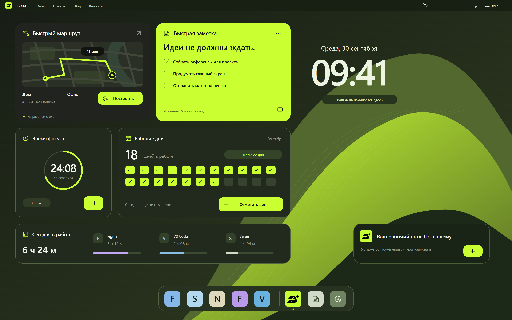
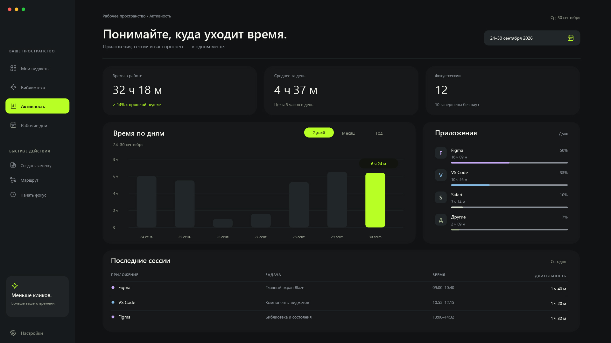
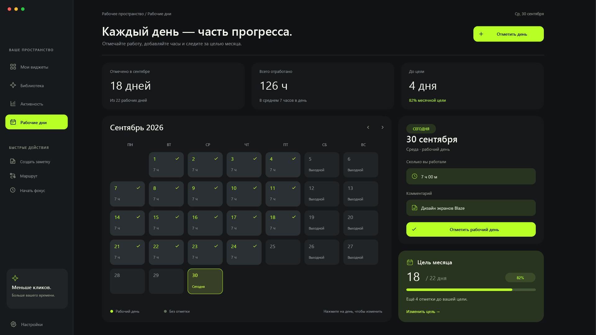
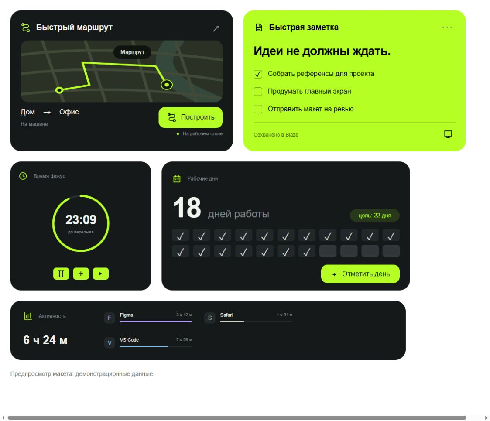
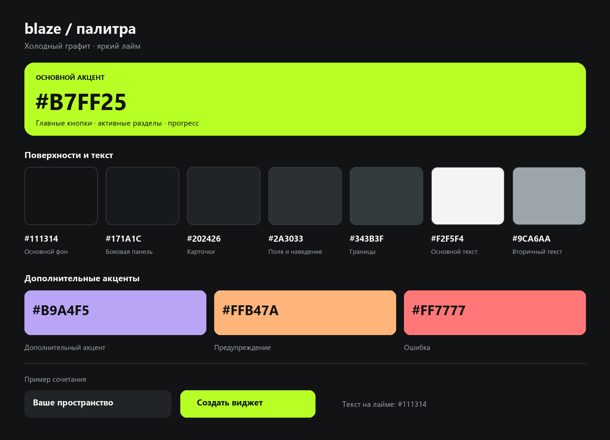
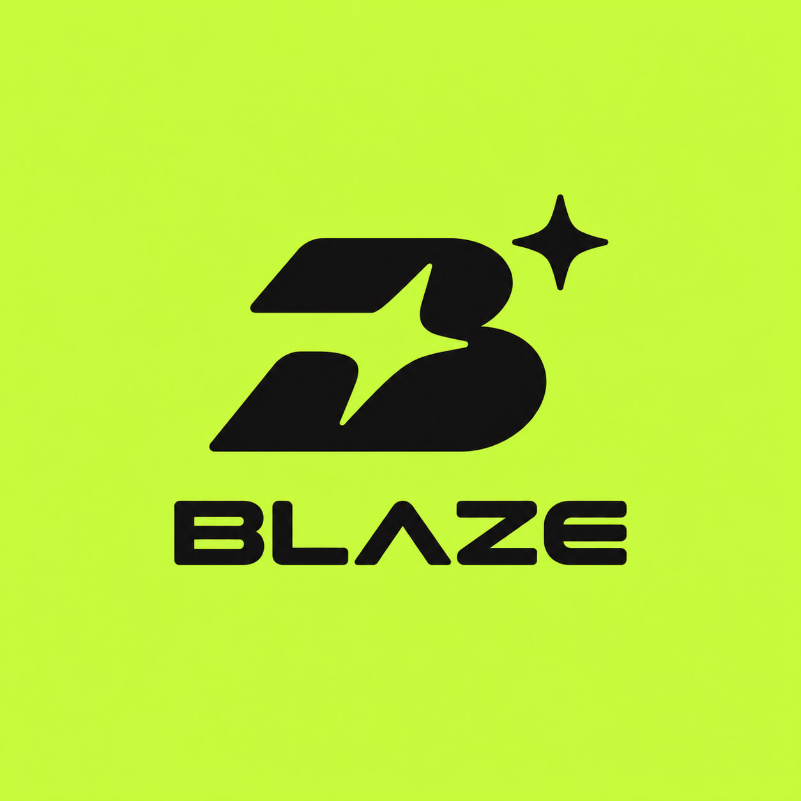
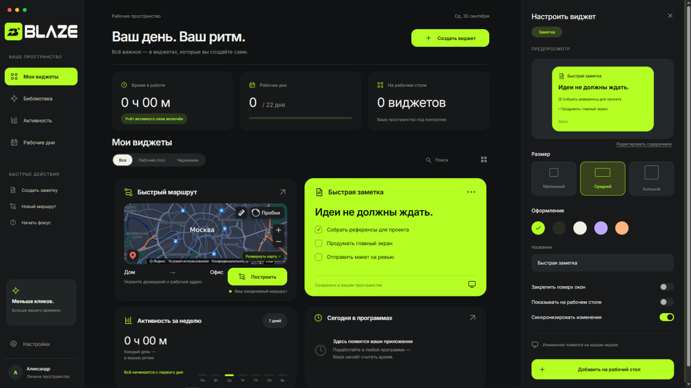
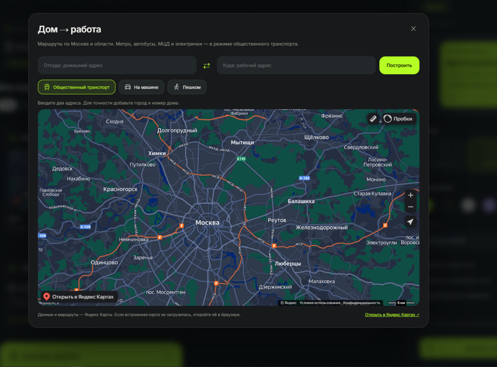
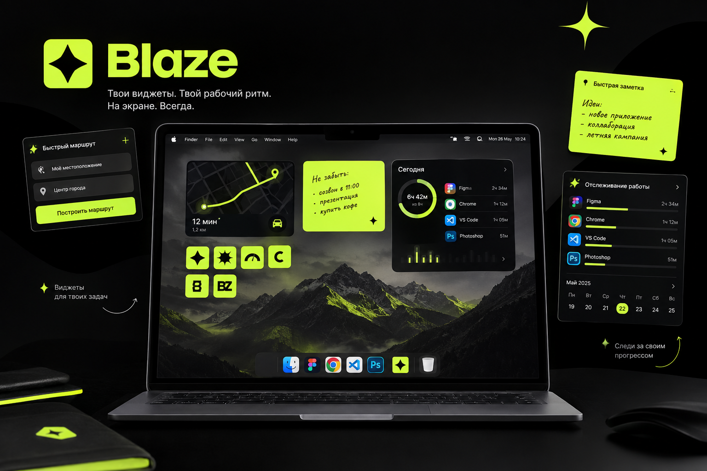
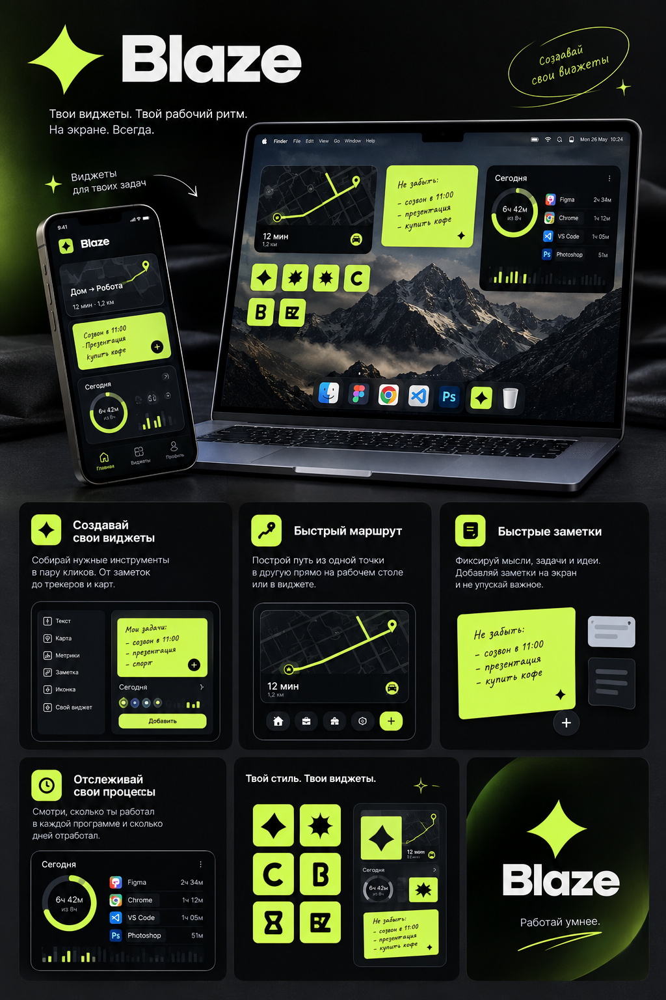

# Галерея дизайна Blaze

## Рабочий стол: основное направление

Авторский концепт показывает расположение маршрута, заметки, фокуса, рабочих дней и активности на едином рабочем столе. Верхнее меню, часы, фон и нижняя панель в этой композиции — элементы макета; текущий прототип Windows не заменяет оболочку операционной системы.

## Главная и настройка виджета

Обзор дня, библиотека личных карточек и панель настройки размера, цвета и вывода на экран.

## Активность

Крупные показатели, график времени по дням, доли приложений и последние сессии. Числа в макете иллюстративные.

## Рабочие дни

Календарь отметок, ввод часов и комментария, месячная цель и прогресс.

## Отдельные виджеты

Снимок HTML-предпросмотра реализованных окон. Здесь используются демонстрационные данные. Результат отличается от полного концепта рабочего стола: каждый виджет открывается отдельным окном Electron.

## Логотип и палитра

Точные значения палитры из авторского материала и текущие значения в стилях приведены в [отчёте по дизайну](reports/DESIGN-REPORT.md).

## Снимки раннего прототипа

Предоставленный снимок ранней сборки от 30 сентября 2026 года. Он документирует развитие интерфейса; отдельные элементы могли измениться после этого снимка.

Встроенные Яндекс Карты: Москва и область, переключение режима и ввод двух адресов. Интерфейс самой карты принадлежит Яндексу.

## Презентационные концепции

Презентационный образ рабочего пространства: виджеты, заметки и рабочий ритм на одном экране. Это концепция, а не снимок готовой macOS-версии.

Визуальное раскрытие идеи через маршруты, заметки, персонализацию и активность. Телефон показывает направление развития; мобильного приложения в текущей сборке нет. Звёздный знак в этих концептах представляет раннее визуальное направление; используемый сейчас логотип B приведён в брендовых материалах выше.

## Материалы

В этой галерее сохранены авторские макеты, брендовые материалы и снимки интерфейса, предоставленные для проекта. Презентационные изображения с телефоном и MacBook включены с подписями, обозначающими концепцию развития. Текущая реализация предназначена для Windows.
